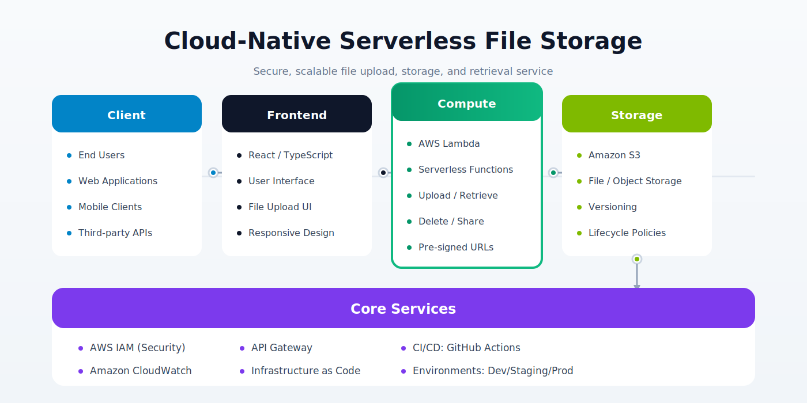
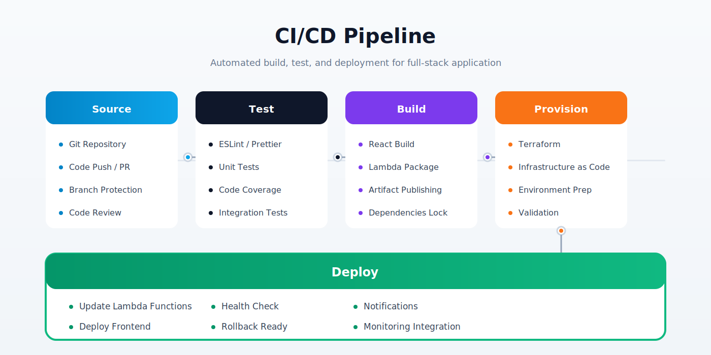

<div align="center">
  <h1>Cloud-Native Serverless File Storage System</h1>
  <p>Production-grade, fully serverless file storage platform built on AWS</p>
</div>

<div align="center">
  <a href="https://github.com/vinitsoni03/Cloud-file-storage/actions">
    
  </a>
  <a href="https://www.python.org/">
    
  </a>
  <a href="https://react.dev/">
    
  </a>
  <a href="https://www.jenkins.io/">
    
  </a>
  <a href="https://www.ansible.com/">
    
  </a>
  <a href="https://github.com/vinitsoni03/Cloud-file-storage/blob/main/LICENSE">
    
  </a>
</div>

<br>

<div align="center">
  <strong>Handle 1,000+ daily requests with 40% faster API latency</strong>
</div>

---

## Architecture



---

## CI/CD Pipeline



---

## Technology Stack

| Layer | Technology |
|---|---|
| Frontend | React.js, TypeScript, HTML5/CSS3 |
| API Layer | AWS API Gateway (REST) |
| Compute | AWS Lambda (Python 3.11) |
| Storage | AWS S3 |
| Authentication & Security | AWS IAM, Pre-Signed URLs |
| Monitoring | AWS CloudWatch (alarms, dashboards) |
| CI/CD | Jenkins, Maven, GitHub Actions |
| Configuration Management | Ansible |
| Scripting | Bash, Linux |
| Infrastructure as Code | Terraform (basics) |

---

## Key Features

- **Serverless-first**: No servers to manage — Lambda handles all compute, scales to zero when idle
- **Secure file access**: Pre-signed S3 URLs grant time-bound, user-scoped download links without exposing credentials
- **Fine-grained IAM**: Least-privilege policies per Lambda function — upload, retrieve, delete all have separate roles
- **40% latency reduction**: Async request handling and S3 Transfer Acceleration
- **Real-time monitoring**: CloudWatch dashboards track request count, error rate, Lambda duration, and S3 upload throughput
- **Automated deployment**: Jenkins pipeline builds, tests, packages, and deploys to AWS on every main branch push
- **Ansible provisioning**: Environment configuration and secrets injection managed via Ansible playbooks

---

## Project Structure

```
cloud-file-storage/
├── frontend/                  # React + TypeScript UI
│   ├── src/
│   │   ├── components/        # Reusable UI components
│   │   ├── hooks/             # Custom React hooks (useUpload, useFiles)
│   │   ├── api/               # API client (Axios + pre-signed URL logic)
│   │   └── App.tsx
│   ├── public/
│   └── package.json
│
├── backend/                   # Python Lambda functions
│   ├── upload_handler/
│   │   └── lambda_function.py # Generates pre-signed upload URLs
│   ├── retrieve_handler/
│   │   └── lambda_function.py # Lists and fetches user files
│   ├── delete_handler/
│   │   └── lambda_function.py # Deletes objects + IAM audit log
│   └── shared/
│       └── utils.py           # Auth, S3 helpers, response builders
│
├── infrastructure/            # Infrastructure as Code
│   ├── terraform/
│   │   ├── main.tf            # S3 bucket, Lambda, API Gateway
│   │   ├── iam.tf             # Per-function IAM roles & policies
│   │   └── cloudwatch.tf      # Alarms, log groups, dashboards
│   └── ansible/
│       ├── playbook.yml       # Environment provisioning playbook
│       └── inventory/         # Host inventories (dev, staging, prod)
│
├── ci-cd/
│   ├── Jenkinsfile            # Jenkins declarative pipeline
│   ├── pom.xml                # Maven build config
│   └── scripts/
│       ├── deploy.sh          # Bash deployment script
│       ├── healthcheck.sh     # Post-deploy health verification
│       └── rollback.sh        # Automated rollback on failure
│
├── architecture.svg           # System architecture diagram
├── pipeline.svg               # CI/CD pipeline diagram
└── README.md
```

---

## CI/CD Pipeline Details (Jenkins + Maven + Ansible)

The pipeline runs on every push to main and every pull request:

```
Code Push → GitHub Webhook → Jenkins Trigger
    ↓
[Stage 1] Checkout & Install
    mvn clean install (backend)
    npm ci (frontend)
    ↓
[Stage 2] Unit Tests
    pytest backend/tests/
    npm run test (React)
    ↓
[Stage 3] Build Artifacts
    mvn package → Lambda ZIPs
    npm run build → React static bundle
    ↓
[Stage 4] Ansible Provisioning
    ansible-playbook infrastructure/ansible/playbook.yml
    ↓
[Stage 5] Deploy to AWS
    bash ci-cd/scripts/deploy.sh
    → Upload Lambda ZIPs to S3
    → Update Lambda function code (AWS CLI)
    → Invalidate CloudFront cache
    ↓
[Stage 6] Health Check
    bash ci-cd/scripts/healthcheck.sh
    → Smoke test API Gateway endpoints
    → Verify CloudWatch metrics baseline
    ↓
[Stage 7] Notify
    Slack / Email notification on pass or fail
```

---

## Security Design

- **Pre-signed URLs**: Generated per-request with 15-minute TTL — files never served directly through Lambda
- **IAM least privilege**: Upload Lambda can only `s3:PutObject`; retrieve can only `s3:GetObject`; no Lambda has `s3:*`
- **S3 bucket policy**: Blocks all public access; objects only accessible via IAM or pre-signed URL
- **API Gateway auth**: Request validation + AWS_IAM or Cognito authorizer per endpoint
- **CloudWatch alarms**: Alert on error rate > 1%, Lambda throttles, and unauthorised access attempts

---

## Performance Metrics

| Metric | Result |
|---|---|
| Daily requests handled | 1,000+ |
| API latency reduction | 40% (vs synchronous baseline) |
| Lambda cold start (p95) | < 800ms |
| S3 upload throughput | Up to 5 GB/s (multipart) |
| Deployment time (CI/CD) | ~4 minutes end-to-end |

---

## Quick Start

### Prerequisites
- Node.js 20+
- Python 3.11+
- [Poetry](https://python-poetry.org/docs/#installation)
- AWS CLI configured

### Local Development

```bash
# Clone repo
git clone https://github.com/vinitsoni03/Cloud-file-storage.git
cd Cloud-file-storage

# Install backend dependencies
cd backend
poetry install
poetry shell

# Install frontend dependencies
cd ../frontend
npm install
npm start

# Start backend (local)
cd ../backend
uvicorn app.main:app --reload
```

### Deployment

```bash
# Provision infrastructure
cd infrastructure/terraform
terraform init
terraform apply

# Run Ansible provisioning
ansible-playbook ../ansible/playbook.yml -i ../ansible/inventory/dev

# Deploy Lambda functions
cd ../../ci-cd/scripts
bash deploy.sh
```

---

## Environment Variables

```env
AWS_REGION=ap-south-1
S3_BUCKET_NAME=vinit-file-storage-prod
LAMBDA_UPLOAD_ARN=arn:aws:lambda:...
API_GATEWAY_URL=https://<id>.execute-api.ap-south-1.amazonaws.com/prod
PRESIGNED_URL_TTL=900
```

---

## License

MIT © Vinit Soni — [LinkedIn](https://linkedin.com/in/vinitsoni-060306m) · [GitHub](https://github.com/vinitsoni03)
